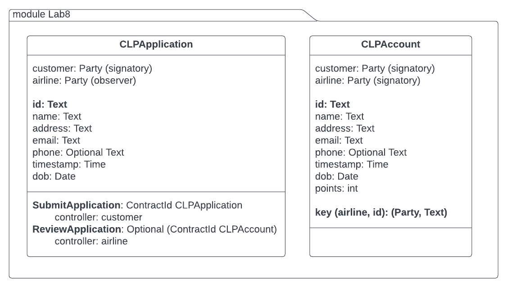
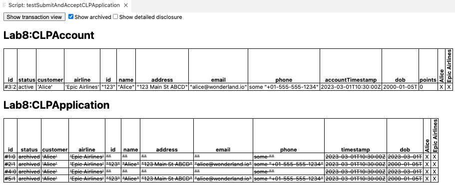
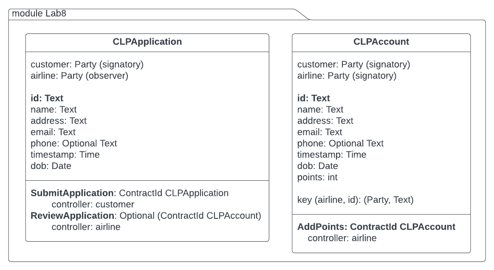
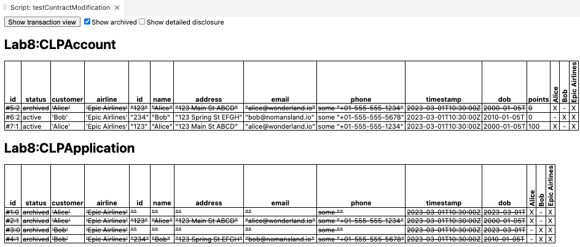

# Lab8 

**Learning objective**: To identify and retrieve contracts and analyze transaction trees

**Prerequisite**
1. Daml SDK installed and setup
2. Daml Fundamentals Training: Canton Ledger Programming in Daml - Lessons 1 to 7 completed.

## Scenario: 

The **Epic Airlines (EA)** needs to implement its **Customer Loyalty Program (CLP)** using Daml. 
Customers can register for CLP anytime. When they register, they get a CLP-account to store their loyalty points.

## Problem statement 1
Modify the choices in the CLPApplication template created in Lab7 to address the following changes in the functionality:

- In **CLPApplication** template 
    - Each customer is expected to provide an id number assigned by an external entity (e.g passport or driving license number). Assume that this id is of type Text and is unique for each customer. 
    - The customer provides this id in the CLPApplication
- In **CLPAccount** template 
    - The template has a key with **airline** as the party and the id mentioned above as its two elements. The airline is its maintainer. 
- In **CLPApplication** template, 
    - instead of having two separate choices for the airline to Accept and Reject CLP applications, create one choice named **ReviewApplication** that returns an **Optional (ContractId CLPAccount)**. 
    - In this choice, the airline checks if the customer already has CLPAccount using the id as the key. If not, then it creates a new CLPAccount for the customer. It yes, then the application is rejected and no account is created. 

Here is the new diagram that shows the revised templates and choices. 



### Hints:
While there are several ways to design the template and the choices to get the functioanlity described above, here are some of the functions that you may find useful:
- [lookupByKey](https://docs.daml.com/daml/stdlib/Prelude.html#function-da-internal-template-functions-lookupbykey-92781) 
- [isSome](https://docs.daml.com/search.html?query=isSome) or [isNone](https://docs.daml.com/search.html?query=isNone) 


Here is a script to test your templates and choices:
```
module TestLab8 where 

import Daml.Script
import Lab8 
import DA.Date (toDateUTC, date, Month(Jan), Month(Mar))
import DA.Time (time)

testSubmitAndAcceptCLPApplication: Script () 
testSubmitAndAcceptCLPApplication = script do 
    alice <- allocateParty "Alice"
    airline <- allocateParty "Epic Airlines"
    
    setTime (time (date 2023 Mar 01) 10 30 0)
    now <- getTime 

    -- Alice creates a blank CLPApplication
    aliceCLPAppId <- submit alice do         
        createCmd CLPApplication with  
            customer = alice 
            airline = airline 
            id = ""
            name = ""
            address = ""
            email = ""
            phone = Some ""
            timestamp = now 
            dob = toDateUTC now

    -- Alice submits the application with details filled in
    aliceCLPAppId <- submit alice do 
        exerciseCmd aliceCLPAppId SubmitApplication 
            with
                appCustomer = alice 
                appAirline = airline
                customerId = "123"
                customerName = "Alice"
                customerAddress = "123 Main St ABCD"
                customerEmail = "alice@wonderland.io"
                customerPhone = "+01-555-555-1234"
                timeStamp = now
                customerDob = date 2000 Jan 05    

    -- Airline reviews application. This should result in a new CLPAccount for Alice
    aliceCLPAccount <- submit airline do 
        exerciseCmd aliceCLPAppId ReviewApplication 
            with 
                customerId = "123"

    -- Alice creates another blank application
    aliceCLPAppId <- submit alice do         
        createCmd CLPApplication with  
            customer = alice 
            airline = airline 
            id = ""
            name = ""
            address = ""
            email = ""
            phone = Some ""
            timestamp = now 
            dob = toDateUTC now

   -- Alice submits another application with details filled in with the same 'id'
    aliceCLPAppId <- submit alice do 
        exerciseCmd aliceCLPAppId SubmitApplication 
            with
                appCustomer = alice 
                appAirline = airline
                customerId = "123"
                customerName = "Alice"
                customerAddress = "123 Main St ABCD"
                customerEmail = "alice@wonderland.io"
                customerPhone = "+01-555-555-1234"
                timeStamp = now
                customerDob = date 2000 Jan 05    

    -- Airline reviews it but no new account for Alice should be created
    aliceCLPAccount <- submit airline do 
        exerciseCmd aliceCLPAppId ReviewApplication 
            with 
                customerId = "123"

    return()
```

When this script is executed, the output in the table view should look like as shown below:



Notice that the second attempt to create a CLPAccount is not entertained. 

Next, switch to the Transaction Tree view and trace how the first CLP application is accepted and a CLP account is created, while the second CLP application is simply archived and no new account is created.  


## Problem statement 2

Change the test script listed above to meet the following requirements:

- Instead of hardcoding the value of customerId as "123" in the submit statements as shown below, 

```
   -- Airline reviews application. This should result in a new CLPAccount for Alice
    aliceCLPAccount <- submit airline do 
        exerciseCmd aliceCLPAppId ReviewApplication 
            with 
                customerId = "123"
```

use the aliceCLPAppId to extract the id from the contract payload and then use that value to for exercising ReviewApplication choice. 


## Problem statement 3

1. Modify the CLPAccount template to add a choice named **AddPoints** that takes an int as the number of points to be added to the account and returns **ContractId CLPAccount**. Make airline as the controller of this choice. 

2. Write a test script that performs the following actions:
- Alice submits a CLPApplication
- Bob submits a CLPApplication
- Airline reviews Alice's application and creates her CLPAccount with 0 points
- Airline reviews Bob's application and creates his CLPAccount with 0 points
- Query for all accounts visible to the airline.
- Airline exercises AddPoints choice to add 100 points to the first account in the list returned by the above query. 

The following diagram shows the revised templates and choices:




If your templates and test-scripts work correctly, then you should see the following in the output:



